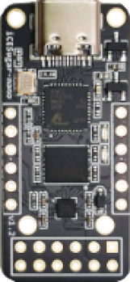

# ICESugarNano

ICESugarNano - usable as sat only

| Name | Value |
| --- | --- |
| Family | ice40 |
| Type | lp1k |
| Clock | 12.0 |
| Toolchain | icestorm |
| URL | [link](https://github.com/wuxx/icesugar-nano) |

## Slots
### FLASH
SPI FLASH

| Name | Pin | Direction |
| --- | --- | --- |
| MOSI | E4 | input |
| MISO | F5 | output |
| SCLK | E5 | output |
| SEL | D5 | output |

### PMOD3

| Name | Pin | Direction |
| --- | --- | --- |
| P4 | B1 | all |
| P3 | E1 | all |
| P2 | B5 | all |
| P1 | B4 | all |
| P10 | A1 | all |
| P9 | C2 | all |
| P8 | E3 | all |
| P7 | C6 | all |
| 3V3_1 | 3V3 | all |
| GND_1 | GND | all |
| 3V3_2 | 3V3 | all |
| GND_2 | GND | all |

### PMOD1

| Name | Pin | Direction |
| --- | --- | --- |
| P4 | A1 | all |
| P3 | B1 | all |
| P2 | D1 | input |
| P1 | E2 | all |
| 3V3 | 3V3 | all |
| GND | GND | all |

### PMOD2

| Name | Pin | Direction |
| --- | --- | --- |
| P1 | B3 | all |
| P2 | A3 | input |
| P3 | B6 | all |
| P4 | C5 | all |
| GND | GND | all |
| 3V3 | 3V3 | all |

