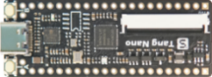

# TangNano1K

TangNano1K - cheap GW1NR-1 Devboard - usable as sat only

| Name | Value |
| --- | --- |
| Family | GW1NZ-1 |
| Type | GW1NZ-LV1QN48C6/I5 |
| Clock | 27.0 |
| Toolchain | gowin (icestorm) |
| URL | [link](https://wiki.sipeed.com/hardware/en/tang/Tang-Nano-1K/Nano-1k.html) |

## Slots
### JTAG

| Name | Pin | Direction |
| --- | --- | --- |
| TCK | TCK | all |
| TDI | TDI | all |
| TMS | TMS | all |
| TDO | TDO | all |

### PIN

| Name | Pin | Direction |
| --- | --- | --- |
| 44 | 44 | all |
| BL_IO27 | BL_IO27 | all |
| BL_IO26 | BL_IO26 | all |
| BL_IO23 | BL_IO23 | all |
| 40 | 40 | all |
| 41 | 41 | all |
| 38 | 38 | all |
| 39 | 39 | all |
| 42 | 42 | all |
| 35 | 35 | all |
| 34 | 34 | all |
| 20 | 20 | all |
| 19 | 19 | all |
| 29 | 29 | all |
| 30 | 30 | all |
| 31 | 31 | all |
| 13 | 13 | all |
| 47 | 47 | output |
| 45 | 45 | all |
| 46 | 46 | all |
| 11 | 11 | all |
| 9 | 9 | all |
| 10 | 10 | all |
| 24 | 24 | all |
| 23 | 23 | all |
| 22 | 22 | all |
| 18 | 18 | all |
| 17 | 17 | all |
| 16 | 16 | all |
| 15 | 15 | all |
| 27 | 27 | all |
| 28 | 28 | all |

### SW

| Name | Pin | Direction |
| --- | --- | --- |
| B | 44 | input |
| A | 13 | input |

### PWR

| Name | Pin | Direction |
| --- | --- | --- |
| GND_1 | GND | input |
| GND_2 | GND | input |
| 3V3_1 | 3V3 | input |
| 3V3_2 | 3V3 | input |
| GND_3 | GND | input |
| GND_4 | GND | input |
| 5V_1 | 5V | input |
| 5V_2 | 5V | input |

