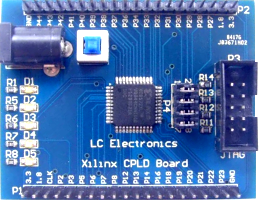

# XC9536XL

XC9536XL - minimal CPLD-Devboard

| Name | Value |
| --- | --- |
| Family | xc9500xl |
| Type |  |
| Clock | 50.0 |
| Toolchain | ise |
| URL | [link](https://www.amazon.de/Bwuikim-Effizientes-Bedienelementen-Lichtanzeigen-Projektboard/dp/B0GVB1BNHL) |

## Slots
### LEDS
LEDS

| Name | Pin | Direction |
| --- | --- | --- |
| LED1 | 0 | output |
| LED2 | 0 | output |
| LED3 | 0 | output |
| LED4 | 0 | output |
| LED5 | 0 | output |

### P2

| Name | Pin | Direction |
| --- | --- | --- |
| GND | GND | all |
| P44 | P44 | all |
| P43 | P43 | all |
| P42 | P42 | all |
| P41 | P41 | all |
| P40 | P40 | all |
| P39 | P39 | all |
| P38 | P38 | all |
| P37 | P37 | all |
| P36 | P36 | all |
| P34 | P34 | all |
| P33 | P33 | all |
| P32 | P32 | all |
| P31 | P31 | all |
| P30 | P30 | all |
| P29 | P29 | all |
| P28 | P28 | all |
| P27 | P27 | all |
| 1V8 | 1V8 | all |
| 3V3 | 3V3 | all |

### P1

| Name | Pin | Direction |
| --- | --- | --- |
| 1V8 | 1V8 | all |
| 3V3 | 3V3 | all |
| CLK | PCLK | all |
| P2 | P2 | all |
| P3 | P3 | all |
| P5 | P5 | all |
| P6 | P6 | all |
| P7 | P7 | all |
| P8 | P8 | all |
| P12 | P12 | all |
| P13 | P13 | all |
| P14 | P14 | all |
| P16 | P16 | all |
| P18 | P18 | all |
| P19 | P19 | all |
| P20 | P20 | all |
| P21 | P21 | all |
| P22 | P22 | all |
| P23 | P23 | all |
| GND | GND | all |

