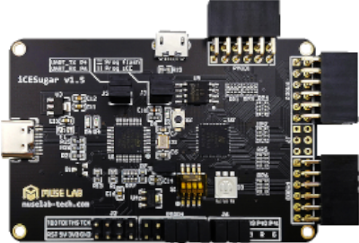

# iCESugar1.5

MuseLab iCESugar 1.5 is based on Lattice iCE40UP5k open source FPGA development board

| Name | Value |
| --- | --- |
| Family | ice40 |
| Type | up5k |
| Clock | 30.0 |
| Toolchain | icestorm |
| URL | [link](https://github.com/wuxx/icesugar) |

## Slots
### UART
USB UART

| Name | Pin | Direction |
| --- | --- | --- |
| RX | 6 | input |
| TX | 4 | output |

### USB
Micro-USB

| Name | Pin | Direction |
| --- | --- | --- |
| DATA_P | 10 | all |
| DATA_N | 9 | all |

### RGB

| Name | Pin | Direction |
| --- | --- | --- |
| GRN | 41 | output |
| RED | 40 | output |
| BLU | 39 | output |

### J6
RGB-Pins

| Name | Pin | Direction |
| --- | --- | --- |
| B | 39 | all |
| G | 40 | all |
| R | 41 | all |
| LED_B | RGB_B | all |
| LED_G | RGB_G | all |
| LED_R | RGB_R | all |

### PMOD1
PMOD 1

| Name | Pin | Direction |
| --- | --- | --- |
| P1 | 10 |  |
| P2 | 6 |  |
| P3 | 3 |  |
| P4 | 48 |  |
| 3V3_1 | 3V3 |  |
| 3V3_2 | 3V3 |  |
| GND_1 | GND |  |
| GND_2 | GND |  |
| P7 | 9 |  |
| P8 | 4 |  |
| P9 | 2 |  |
| P10 | 47 |  |

### PMOD2
PMOD 2

| Name | Pin | Direction |
| --- | --- | --- |
| P1 | 46 |  |
| P2 | 44 |  |
| P3 | 42 |  |
| P4 | 37 |  |
| 3V3_1 | 3V3 |  |
| 3V3_2 | 3V3 |  |
| GND_1 | GND |  |
| GND_2 | GND |  |
| P7 | 45 |  |
| P8 | 43 |  |
| P9 | 38 |  |
| P10 | 36 |  |

### PMOD3
PMOD 3

| Name | Pin | Direction |
| --- | --- | --- |
| P1 | 34 |  |
| P2 | 31 |  |
| P3 | 27 |  |
| P4 | 25 |  |
| 3V3_1 | 3V3 |  |
| 3V3_2 | 3V3 |  |
| GND_1 | GND |  |
| GND_2 | GND |  |
| P7 | 32 |  |
| P8 | 28 |  |
| P9 | 26 |  |
| P10 | 23 |  |

### J7
shared with PMOD1

| Name | Pin | Direction |
| --- | --- | --- |
| P1 | 48 |  |
| P2 | 47 |  |
| 5V | 5V |  |
| GND | GND |  |
| P3 | 3 |  |
| P4 | 2 |  |

### J2
JTAG

| Name | Pin | Direction |
| --- | --- | --- |
| TDO | TDO | all |
| nRST | nRST | all |
| TDI | TDI | all |
| 5V | 5V | all |
| TMS | TDI | all |
| 3V3 | 3V3 | all |
| TCK | TCK | all |
| GND | GND | all |

### PMOD4
PMOD4

| Name | Pin | Direction |
| --- | --- | --- |
| 3V3_1 | 3V3 | all |
| 3V3_2 | 3V3 | all |
| GND_1 | GND | all |
| GND_2 | GND | all |
| P4 | S1-1 | all |
| P10 | 18 | all |
| P3 | S1-2 | all |
| P9 | 19 | all |
| P2 | S1-3 | all |
| P8 | 20 | all |
| P1 | S1-4 | all |
| P7 | 21 | all |

