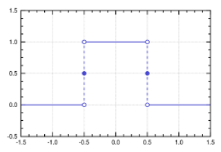

# freqin

**frequency input**

to measurement digital frequencies

* Keywords: frequency
* NEEDS: fpga

## Pins:
*FPGA-pins*
### freq:

 * direction: input

## Options:
*user-options*
### name:
name of this plugin instance

 * type: str
 * default: 

### image:
hardware type

 * type: imgselect
 * default: generic

### freq_min:
minimum measured frequency (for faster updates)

 * type: int
 * min: 1
 * max: 10000
 * default: 10
 * unit: Hz

### freq_max:
maximum measured frequency (for filtering)

 * type: int
 * min: 10
 * max: 10000000
 * default: 1000000
 * unit: Hz

## Signals:
*signals/pins in LinuxCNC*
### frequency:

 * type: float
 * direction: input
 * unit: Hz

### valid:

 * type: bit
 * direction: input

## Interfaces:
*transport layer*
### frequency:

 * size: 32 bit
 * direction: input

### valid:

 * size: 1 bit
 * direction: input

## Verilogs:
 * [freqin.v](freqin.v)
