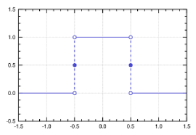

# freqout

**frequency output**

to output variable frequency signals

* Keywords: frequency
* NEEDS: fpga

## Pins:
*FPGA-pins*
### freq:

 * direction: output

## Options:
*user-options*
### name:
name of this plugin instance

 * type: str
 * default: 

### image:
hardware type

 * type: imgselect
 * default: generic

## Signals:
*signals/pins in LinuxCNC*
### frequency:
output frequency

 * type: float
 * direction: output
 * min: 0
 * max: 1000000
 * unit: Hz

## Interfaces:
*transport layer*
### frequency:

 * size: 32 bit
 * direction: output

## Verilogs:
 * [freqout.v](freqout.v)
