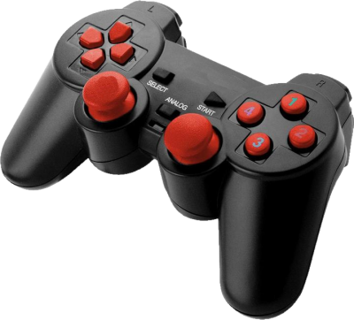

# halinput



**joypad support**

halinput joypad support

Keywords: jog joypad usb

## Pins:
*FPGA-pins*


## Options:
*user-options*
### name:
name of this plugin instance

 * type: str
 * default: 

### joypad_name:

 * type: str
 * default: Joystick

### slow:

 * type: str
 * default: btn-top2

### medium:

 * type: str
 * default: btn-base

### fast:

 * type: str
 * default: btn-pinkie

### x:

 * type: str
 * default: abs-x

### y:

 * type: str
 * default: -abs-y

### z:

 * type: str
 * default: -abs-rz

### a:

 * type: str
 * default: 

### b:

 * type: str
 * default: 

### c:

 * type: str
 * default: 


## Signals:
*signals/pins in LinuxCNC*


## Interfaces:
*transport layer*


## Basic-Example:
```
{
    "type": "halinput",
    "pins": {}
}
```

## Full-Example:
```
{
    "type": "halinput",
    "name": "",
    "joypad_name": "Joystick",
    "slow": "btn-top2",
    "medium": "btn-base",
    "fast": "btn-pinkie",
    "x": "abs-x",
    "y": "-abs-y",
    "z": "-abs-rz",
    "a": "",
    "b": "",
    "c": "",
    "pins": {},
    "signals": {}
}
```
