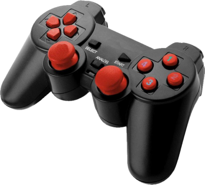

# halinput

**joypad support**

halinput joypad support

* Keywords: jog joypad usb

## Pins:
*FPGA-pins*

## Options:
*user-options*
### name:
name of this plugin instance

 * type: str
 * default: 

### joypad_name:

 * type: str
 * default: Joystick

### slow:

 * type: str
 * default: btn-top2

### medium:

 * type: str
 * default: btn-base

### fast:

 * type: str
 * default: btn-pinkie

### x:

 * type: str
 * default: abs-x

### x_scale:

 * type: float
 * min: -10000
 * max: 10000
 * default: 127.5

### y:

 * type: str
 * default: abs-y

### y_scale:

 * type: float
 * min: -10000
 * max: 10000
 * default: -127.5

### z:

 * type: str
 * default: abs-rz

### z_scale:

 * type: float
 * min: -10000
 * max: 10000
 * default: -127.5

### a:

 * type: str
 * default: 

### a_scale:

 * type: float
 * min: -10000
 * max: 10000
 * default: 127.5

### b:

 * type: str
 * default: 

### b_scale:

 * type: float
 * min: -10000
 * max: 10000
 * default: 127.5

### c:

 * type: str
 * default: 

### c_scale:

 * type: float
 * min: -10000
 * max: 10000
 * default: 127.5

## Signals:
*signals/pins in LinuxCNC*

## Interfaces:
*transport layer*

