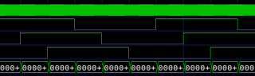

# hallsensor



**bldc hallsensor**

3 phases hallsensor

Keywords: feedback encoder rotary bldc brushless

## Pins:
*FPGA-pins*
### a:

 * direction: input
 * pull: up

### b:

 * direction: input
 * pull: up

### c:

 * direction: input
 * pull: up


## Options:
*user-options*
### poles:
number of motor poles

 * type: int
 * min: 3
 * max: 20
 * default: 7

### rps_sum:
number of collected values before calculate the rps value

 * type: int
 * min: 0
 * max: 100
 * default: 10

### name:
name of this plugin instance

 * type: str
 * default: 


## Signals:
*signals/pins in LinuxCNC*
### position:
position feedback in steps

 * type: float
 * direction: input

### angle:
angle (0-360°)

 * type: float
 * direction: input

### rps:
calculates revolutions per second

 * type: float
 * direction: input

### rpm:
calculates revolutions per minute

 * type: float
 * direction: input


## Interfaces:
*transport layer*
### position:

 * size: 32 bit
 * direction: input

### angle:

 * size: 16 bit
 * direction: input


## Basic-Example:
```
{
    "type": "hallsensor",
    "pins": {
        "a": {
            "pin": "0"
        },
        "b": {
            "pin": "1"
        },
        "c": {
            "pin": "2"
        }
    }
}
```

## Full-Example:
```
{
    "type": "hallsensor",
    "poles": 7,
    "rps_sum": 10,
    "name": "",
    "pins": {
        "a": {
            "pin": "0",
            "modifiers": [
                {
                    "type": "debounce"
                }
            ]
        },
        "b": {
            "pin": "1",
            "modifiers": [
                {
                    "type": "debounce"
                },
                {
                    "type": "invert"
                }
            ]
        },
        "c": {
            "pin": "2",
            "modifiers": [
                {
                    "type": "debounce"
                },
                {
                    "type": "invert"
                }
            ]
        }
    },
    "signals": {
        "position": {
            "net": "xxx.yyy.zzz",
            "function": "rio.xxx",
            "scale": 100.0,
            "offset": 0.0,
            "display": {
                "title": "position",
                "section": "inputs",
                "type": "meter"
            }
        },
        "angle": {
            "net": "xxx.yyy.zzz",
            "function": "rio.xxx",
            "scale": 100.0,
            "offset": 0.0,
            "display": {
                "title": "angle",
                "section": "inputs",
                "type": "meter"
            }
        },
        "rps": {
            "net": "xxx.yyy.zzz",
            "function": "rio.xxx",
            "scale": 100.0,
            "offset": 0.0,
            "display": {
                "title": "rps",
                "section": "inputs",
                "type": "meter"
            }
        },
        "rpm": {
            "net": "xxx.yyy.zzz",
            "function": "rio.xxx",
            "scale": 100.0,
            "offset": 0.0,
            "display": {
                "title": "rpm",
                "section": "inputs",
                "type": "meter"
            }
        }
    }
}
```

## Verilogs:
 * [hallsensor.v](hallsensor.v)
