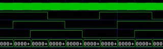

# hallsensor

**bldc hallsensor**

3 phases hallsensor

* Keywords: feedback encoder rotary bldc brushless
* NEEDS: fpga

## Pins:
*FPGA-pins*
### a:

 * direction: input
 * pull: up

### b:

 * direction: input
 * pull: up

### c:

 * direction: input
 * pull: up

## Options:
*user-options*
### name:
name of this plugin instance

 * type: str
 * default: 

### poles:
number of motor poles

 * type: int
 * min: 3
 * max: 20
 * default: 7

### rps_sum:
number of collected values before calculate the rps value

 * type: int
 * min: 0
 * max: 100
 * default: 10

## Signals:
*signals/pins in LinuxCNC*
### position:
position feedback in steps

 * type: float
 * direction: input

### angle:
angle (0-360°)

 * type: float
 * direction: input

### rps:
calculates revolutions per second

 * type: float
 * direction: input

### rpm:
calculates revolutions per minute

 * type: float
 * direction: input

## Interfaces:
*transport layer*
### position:

 * size: 32 bit
 * direction: input

### angle:

 * size: 16 bit
 * direction: input

## Verilogs:
 * [hallsensor.v](hallsensor.v)
