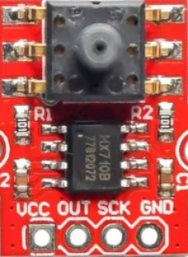

# hx710

**24bit adc**

24bit adc (HX710B)

* Keywords: adc analog
* NEEDS: fpga

## Pins:
*FPGA-pins*
### miso:

 * direction: input

### sclk:

 * direction: output

## Options:
*user-options*
### name:
name of this plugin instance

 * type: str
 * default: 

### image:
hardware type

 * type: imgselect
 * default: generic

### zero:
zero value

 * type: int
 * default: 1379496

### scale:
scale value

 * type: float
 * default: 1e-05

## Signals:
*signals/pins in LinuxCNC*
### pressure:

 * type: float
 * direction: input
 * unit: ?

## Interfaces:
*transport layer*
### pressure:

 * size: 32 bit
 * direction: input
 * multiplexed: True

## Verilogs:
 * [hx710.v](hx710.v)
