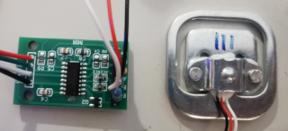

# hx711

**digital weight sensor**

to measure weight's

* Keywords: adc analog weight
* NEEDS: fpga

## Pins:
*FPGA-pins*
### miso:

 * direction: input

### sclk:

 * direction: output

## Options:
*user-options*
### name:
name of this plugin instance

 * type: str
 * default: 

### zero:
zero value

 * type: int
 * default: 0

### scale:
scale value

 * type: float
 * default: 1.0

### mode:
sensor mode

 * type: select
 * default: CHA_128
 * options: CHA_128, CHB_32, CHB_64

## Signals:
*signals/pins in LinuxCNC*
### weight:

 * type: float
 * direction: input
 * unit: Kg

### tare:

 * type: bit
 * direction: input

### toffset:

 * type: float
 * direction: output

## Interfaces:
*transport layer*
### weight:

 * size: 32 bit
 * direction: input
 * multiplexed: True

## Verilogs:
 * [hx711.v](hx711.v)
