# i2c_device
**i2c device**

i2c device

* Keywords: i2c
* NEEDS: i2c

## Node-Types
| Name | Image |
| --- | --- |
| pcf8574 | 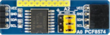 |
| bmp280 | 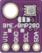 |
| lm75 | 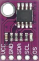 |
| vl53l0x | 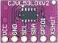 |
| ads1115 | 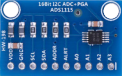 |
| mcp4725 | 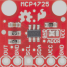 |
| tca9548a | 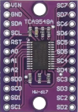 |
| mlx90614 | 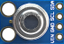 |
| adxl345 | 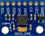 |
| as5600 | 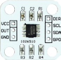 |
| ina219 | 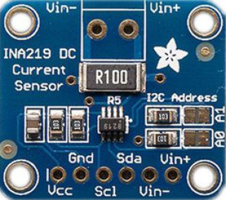 |
| pcf8591 | 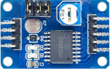 |
| mcp23017 | 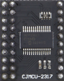 |
| pca9685 | 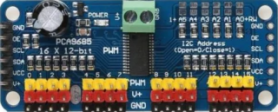 |
| ina3221 | 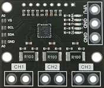 |
| tlv493d | 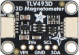 |

## Pins:
*FPGA-pins*

## Options:
*user-options*
### name:
name of this plugin instance

 * type: str
 * default: 

### node_type:
device type

 * type: select
 * default: 
 * options: pcf8574, bmp280, lm75, vl53l0x, ads1115, mcp4725, tca9548a, mlx90614, adxl345, as5600, ina219, pcf8591, mcp23017, pca9685, ina3221, tlv493d

## Signals:
*signals/pins in LinuxCNC*

## Interfaces:
*transport layer*

