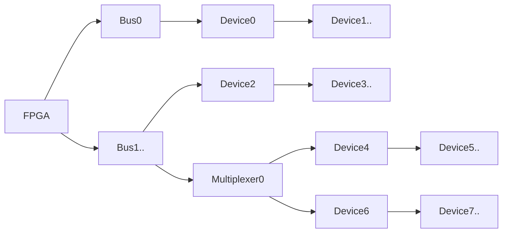

# i2cbus


**I2C-Bus**

* multiple busses
* multiple devices per bus
* multiple clocks per bus (by device)
* sub-busses via multiplexer (pca9548)
* non-blocking delays for slow devices
        

Devices:
* [ads1115](devices/ads1115.py)
* [adxl345](devices/adxl345.py)
* [as5600](devices/as5600.py)
* [lm75](devices/lm75.py)
* [mcp23017](devices/mcp23017.py)
* [mlx90614](devices/mlx90614.py)
* [pca9685](devices/pca9685.py)
* [pcf8574](devices/pcf8574.py)
* [tlv493d](devices/tlv493d.py)

Keywords: adc temperatur voltage current



## Pins:
*FPGA-pins*
### sda:

 * direction: inout

### scl:

 * direction: output


## Options:
*user-options*
### speed:
I2C-Clockspeed

 * type: int
 * min: 100
 * max: 50000000
 * default: 100000
 * unit: Hz

### multiplexer:
Sub-Bus multiplexer address (pca9548)

 * type: select
 * default: 

### name:
name of this plugin instance

 * type: str
 * default: 


## Signals:
*signals/pins in LinuxCNC*


## Interfaces:
*transport layer*


## Basic-Example:
```
{
    "type": "i2cbus",
    "pins": {
        "sda": {
            "pin": "0"
        },
        "scl": {
            "pin": "1"
        }
    }
}
```

## Full-Example:
```
{
    "type": "i2cbus",
    "speed": 100000,
    "multiplexer": "",
    "name": "",
    "pins": {
        "sda": {
            "pin": "0",
            "modifiers": [
                {
                    "type": "invert"
                }
            ]
        },
        "scl": {
            "pin": "1",
            "modifiers": [
                {
                    "type": "invert"
                }
            ]
        }
    },
    "signals": {}
}
```

## Verilogs:
 * [i2c_master.v](i2c_master.v)
