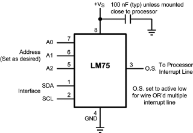

# lm75
**I2C Temperature-Sensor**

simple temperature sensor

Keywords: analog adc temperature




## Basic-Example:
```
{
    "type": "lm75",
    "pins": {
        "sda": {
            "pin": "0"
        },
        "scl": {
            "pin": "1"
        }
    }
}
```

## Pins:
*FPGA-pins*
### sda:

 * direction: inout

### scl:

 * direction: output


## Options:
*user-options*
### name:
name of this plugin instance

 * type: str
 * default: 


## Signals:
*signals/pins in LinuxCNC*
### temperature:

 * type: float
 * direction: input
 * unit: °C


## Interfaces:
*transport layer*
### temperature:

 * size: 16 bit
 * direction: input


## Full-Example:
```
{
    "type": "lm75",
    "name": "",
    "pins": {
        "sda": {
            "pin": "0",
            "modifiers": [
                {
                    "type": "invert"
                }
            ]
        },
        "scl": {
            "pin": "1",
            "modifiers": [
                {
                    "type": "invert"
                }
            ]
        }
    },
    "signals": {
        "temperature": {
            "net": "xxx.yyy.zzz",
            "function": "rio.xxx",
            "scale": 100.0,
            "offset": 0.0,
            "display": {
                "title": "temperature",
                "section": "inputs",
                "type": "meter"
            }
        }
    }
}
```

## Verilogs:
 * [lm75.v](lm75.v)
