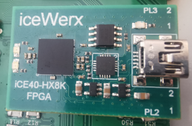

# icewerxadc

**4-channel adc of the iceWerx-board**

to read analog signals from the iceWerx-board

Range: 0-3.3V -> 0-1024

https://eu.robotshop.com/de/products/devantech-icewerx-ice40-hx8k-fpga

should work also with the iceFUN board

* Keywords: analog adc voltage ampere
* NEEDS: fpga, icewerx

## Pins:
*FPGA-pins*
### tx:

 * direction: output

### rx:

 * direction: input

## Options:
*user-options*
### name:
name of this plugin instance

 * type: str
 * default: 

### image:
hardware type

 * type: imgselect
 * default: generic

## Signals:
*signals/pins in LinuxCNC*
### adc1:

 * type: float
 * direction: input
 * unit: Volt

### adc2:

 * type: float
 * direction: input
 * unit: Volt

### adc3:

 * type: float
 * direction: input
 * unit: Volt

### adc4:

 * type: float
 * direction: input
 * unit: Volt

## Interfaces:
*transport layer*
### adc1:
1. ADC channel

 * size: 10 bit
 * direction: input
 * multiplexed: True

### adc2:
2. ADC channel

 * size: 10 bit
 * direction: input
 * multiplexed: True

### adc3:
3. ADC channel

 * size: 10 bit
 * direction: input
 * multiplexed: True

### adc4:
4. ADC channel

 * size: 10 bit
 * direction: input
 * multiplexed: True

## Verilogs:
 * [icewerxadc.v](icewerxadc.v)
 * [uart_baud.v](uart_baud.v)
 * [uart_rx.v](uart_rx.v)
 * [uart_tx.v](uart_tx.v)
