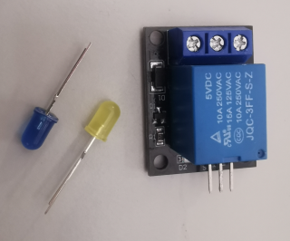

# image



**only an image for the flow plan**

## Pins:
*FPGA-pins*


## Options:
*user-options*
### name:
name of this plugin instance

 * type: str
 * default: 

### image:
hardware type

 * type: select
 * default: generic


## Signals:
*signals/pins in LinuxCNC*


## Interfaces:
*transport layer*


## Basic-Example:
```
{
    "type": "image",
    "pins": {}
}
```

## Full-Example:
```
{
    "type": "image",
    "name": "",
    "image": "generic",
    "pins": {},
    "signals": {}
}
```
