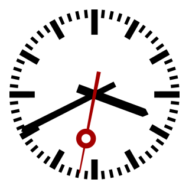

# interval




| :warning: EXPERIMENTAL |
|:-----------------------|

**interval timer**

to control things like lubric pumps

## Pins:
*FPGA-pins*
### out:

 * direction: output


## Options:
*user-options*
### name:
name of this plugin instance

 * type: str
 * default: 


## Signals:
*signals/pins in LinuxCNC*
### enable:

 * type: bit
 * direction: output

### ontime:

 * type: float
 * direction: output
 * min: 0
 * unit: seconds

### interval:

 * type: float
 * direction: output
 * min: 0
 * unit: seconds


## Interfaces:
*transport layer*
### enable:

 * size: 1 bit
 * direction: output
 * multiplexed: True

### ontime:

 * size: 24 bit
 * direction: output
 * multiplexed: True

### interval:

 * size: 24 bit
 * direction: output
 * multiplexed: True


## Basic-Example:
```
{
    "type": "interval",
    "pins": {
        "out": {
            "pin": "0"
        }
    }
}
```

## Full-Example:
```
{
    "type": "interval",
    "name": "",
    "pins": {
        "out": {
            "pin": "0",
            "modifiers": [
                {
                    "type": "invert"
                }
            ]
        }
    },
    "signals": {
        "enable": {
            "net": "xxx.yyy.zzz",
            "function": "rio.xxx",
            "display": {
                "title": "enable",
                "section": "outputs",
                "type": "checkbox"
            }
        },
        "ontime": {
            "net": "xxx.yyy.zzz",
            "function": "rio.xxx",
            "scale": 100.0,
            "offset": 0.0,
            "display": {
                "title": "ontime",
                "section": "outputs",
                "type": "scale"
            }
        },
        "interval": {
            "net": "xxx.yyy.zzz",
            "function": "rio.xxx",
            "scale": 100.0,
            "offset": 0.0,
            "display": {
                "title": "interval",
                "section": "outputs",
                "type": "scale"
            }
        }
    }
}
```

## Verilogs:
 * [interval.v](interval.v)
