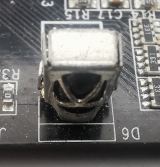

# irin

**IR-Remote input**

that was just a gimmick, not really useful

* Keywords: remote control keyboard
* NEEDS: fpga

## Pins:
*FPGA-pins*
### ir:

 * direction: input

## Options:
*user-options*
### name:
name of this plugin instance

 * type: str
 * default: 

### image:
hardware type

 * type: imgselect
 * default: generic

## Signals:
*signals/pins in LinuxCNC*
### code:

 * type: float
 * direction: input

## Interfaces:
*transport layer*
### code:

 * size: 8 bit
 * direction: input

## Verilogs:
 * [irin.v](irin.v)
