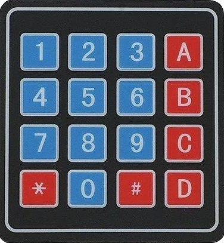

# keymatrix

**Matix-Keyboard**

input for matrix keyboards

* Keywords: keyboard keys
* NEEDS: fpga

## Pins:
*FPGA-pins*
### col0:

 * direction: output

### col1:

 * direction: output

### col2:

 * direction: output

### col3:

 * direction: output

### row0:

 * direction: input
 * pull: UP

### row1:

 * direction: input
 * pull: UP

### row2:

 * direction: input
 * pull: UP

### row3:

 * direction: input
 * pull: UP

## Options:
*user-options*
### name:
name of this plugin instance

 * type: str
 * default: 

### cols:
number cols

 * type: int
 * min: 0
 * max: 8
 * default: 4

### rows:
number rows

 * type: int
 * min: 0
 * max: 8
 * default: 4

## Signals:
*signals/pins in LinuxCNC*
### value:

 * type: float
 * direction: input

## Interfaces:
*transport layer*
### value:

 * size: 8 bit
 * direction: input

## Verilogs:
 * [keymatrix.v](keymatrix.v)
