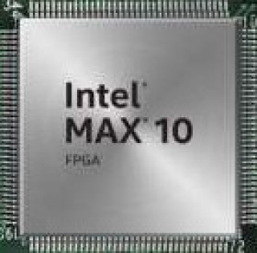

# max10adc

**MAX10 ADC inputs**

only usable for the max10 fpga boards

* Keywords: analog adc voltage ampere
* NEEDS: fpga, max10

## Pins:
*FPGA-pins*

## Options:
*user-options*
### name:
name of this plugin instance

 * type: str
 * default: 

### image:
hardware type

 * type: imgselect
 * default: generic

## Signals:
*signals/pins in LinuxCNC*
### adc0:

 * type: float
 * direction: input

### adc1:

 * type: float
 * direction: input

### adc2:

 * type: float
 * direction: input

### adc3:

 * type: float
 * direction: input

### adc4:

 * type: float
 * direction: input

### adc5:

 * type: float
 * direction: input

### adc6:

 * type: float
 * direction: input

### adc7:

 * type: float
 * direction: input

## Interfaces:
*transport layer*
### adc0:

 * size: 16 bit
 * direction: input

### adc1:

 * size: 16 bit
 * direction: input

### adc2:

 * size: 16 bit
 * direction: input

### adc3:

 * size: 16 bit
 * direction: input

### adc4:

 * size: 16 bit
 * direction: input

### adc5:

 * size: 16 bit
 * direction: input

### adc6:

 * size: 16 bit
 * direction: input

### adc7:

 * size: 16 bit
 * direction: input

## Verilogs:
 * [max10adc.v](max10adc.v)
