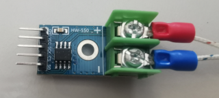

# max6675

**SPI temperature sensor**

to measurement very high temperatures of up to 1250 degrees Celsius

* Keywords: analog adc
* NEEDS: fpga

## Pins:
*FPGA-pins*
### miso:

 * direction: input

### sclk:

 * direction: output

### sel:

 * direction: output

## Options:
*user-options*
### name:
name of this plugin instance

 * type: str
 * default: 

### image:
hardware type

 * type: imgselect
 * default: generic

## Signals:
*signals/pins in LinuxCNC*
### temperature:

 * type: float
 * direction: input
 * unit: °C

## Interfaces:
*transport layer*
### temperature:

 * size: 16 bit
 * direction: input

## Verilogs:
 * [max6675.v](max6675.v)
