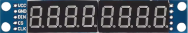

# max7219

**7segment display based on max7219**

to display values on 7segment display's (needs 5V power)

* Keywords: info display
* NEEDS: fpga

## Pins:
*FPGA-pins*
### mosi:

 * direction: output

### sclk:

 * direction: output

### sel:

 * direction: output

## Options:
*user-options*
### name:
name of this plugin instance

 * type: str
 * default: 

### image:
hardware type

 * type: imgselect
 * default: generic

### brightness:
display brightness

 * type: int
 * min: 0
 * max: 15
 * default: 15

### frequency:
interface clock frequency

 * type: int
 * min: 100000
 * max: 10000000
 * default: 1000000

### displays:
number of displays / values

 * type: int
 * min: 1
 * max: 10
 * default: 1

## Signals:
*signals/pins in LinuxCNC*
### value0:

 * type: float
 * direction: output
 * min: -999999
 * max: 999999

## Interfaces:
*transport layer*
### value0:

 * size: 24 bit
 * direction: output
 * multiplexed: True

## Verilogs:
 * [max7219.v](max7219.v)
