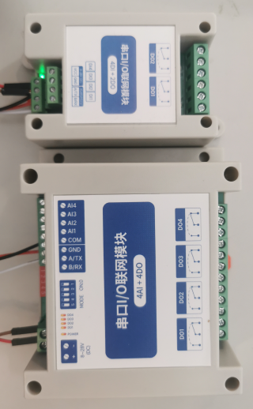

# mbus

**modbus plugin**

to read and write values (analog/digital) via modbus, also supports hy_vfd spindles

* Keywords: modbus rtu vfd spindle expansion analog digital
* URL: https://www.modbustools.com/modbus.html#function16
* NEEDS: fpga
* PROVIDES: modbus

## Pins:
*FPGA-pins*
### rx:

 * direction: input

### tx:

 * direction: output

### tx_enable:

 * direction: output

### BUS:IO:

 * direction: output

## Options:
*user-options*
### name:
name of this plugin instance

 * type: str
 * default: 

### baud:
serial baud rate

 * type: int
 * min: 300
 * max: 10000000
 * default: 9600
 * unit: bit/s

### rx_buffersize:
max rx buffer size

 * type: int
 * min: 32
 * max: 255
 * default: 128
 * unit: bits

### tx_buffersize:
max tx buffer size

 * type: int
 * min: 32
 * max: 255
 * default: 128
 * unit: bits

## Signals:
*signals/pins in LinuxCNC*

## Interfaces:
*transport layer*
### rxdata:

 * size: 128 bit
 * direction: input

### txdata:

 * size: 128 bit
 * direction: output

## Verilogs:
 * [mbus.v](mbus.v)
 * [uart_baud.v](uart_baud.v)
 * [uart_rx.v](uart_rx.v)
 * [uart_tx.v](uart_tx.v)
