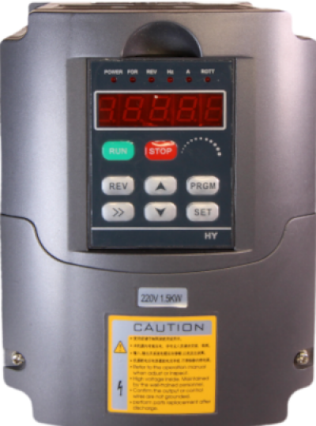

# mbus_hy

**modbus hy vfd**

modbus hy vfd

* Keywords: modbus
* NEEDS: modbus

## Pins:
*FPGA-pins*
### MODBUS:

 * direction: output

## Options:
*user-options*
### name:
name of this plugin instance

 * type: str
 * default: 

### image:
hardware type

 * type: imgselect
 * default: generic

### address:
device address

 * type: int
 * min: 1
 * max: 255
 * default: 1

### priority:
device priority

 * type: int
 * min: 1
 * max: 9
 * default: 9

### timeout:
device timeout

 * type: int
 * min: 10
 * max: 400
 * default: 160

### delay:
device delay

 * type: int
 * min: 10
 * max: 400
 * default: 100

## Signals:
*signals/pins in LinuxCNC*
### speed_command:

 * type: float
 * direction: output
 * unit: RPM

### speed_fb_rps:

 * type: float
 * direction: input
 * unit: RPS

### spindle_at_speed_tolerance:

 * type: float
 * direction: output
 * unit: 

### spindle_forward:

 * type: bit
 * direction: output

### spindle_reverse:

 * type: bit
 * direction: output

### spindle_on:

 * type: bit
 * direction: output

### at_speed:

 * type: bit
 * direction: input
 * unit: 

### max_freq:

 * type: float
 * direction: input
 * unit: Hz

### base_freq:

 * type: float
 * direction: input
 * unit: Hz

### freq_lower_limit:

 * type: float
 * direction: input
 * unit: Hz

### rated_motor_voltage:

 * type: float
 * direction: input
 * unit: V

### rated_motor_current:

 * type: float
 * direction: input
 * unit: A

### rpm_at_50hz:

 * type: float
 * direction: input
 * unit: RPM

### rated_motor_rev:

 * type: float
 * direction: input
 * unit: RPM

### speed_fb:

 * type: float
 * direction: input
 * unit: RPM

### error_count:

 * type: float
 * direction: input
 * unit: 

### hycomm_ok:

 * type: bit
 * direction: input
 * unit: 

### frq_set:

 * type: float
 * direction: input
 * unit: Hz

### frq_get:

 * type: float
 * direction: input
 * unit: Hz

### ampere:

 * type: float
 * direction: input
 * unit: A

### rpm:

 * type: float
 * direction: input
 * unit: RPM

### dc_volt:

 * type: float
 * direction: input
 * unit: V

### ac_volt:

 * type: float
 * direction: input
 * unit: V

### vfd_errors:
vfd

 * type: float
 * direction: input

## Interfaces:
*transport layer*

