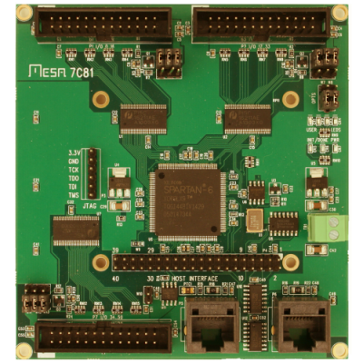

# mesa



**support for mesa-cards with hm2 firmware**

## flashing 7i92
mesaflash --device 7i92 --addr 10.10.10.10  --write /mnt/data2/src/riocore/MI^C/mesact_firmware/7i92/7i92_G540x2D.bit

Keywords: stepgen pwm mesa board hm2

## Pins:
*FPGA-pins*
### P1:P1:

 * direction: all

### P1:P14:

 * direction: all

### P1:P2:

 * direction: all

### P1:P15:

 * direction: all

### P1:P3:

 * direction: all

### P1:P16:

 * direction: all

### P1:P4:

 * direction: all

### P1:P17:

 * direction: output

### P1:P5:

 * direction: input

### P1:P6:

 * direction: input

### P1:P7:

 * direction: input

### P1:P8:

 * direction: input

### P1:P9:

 * direction: input

### P1:P10:

 * direction: input

### P1:P11:

 * direction: input

### P1:P12:

 * direction: input

### P1:P13:

 * direction: input

### P1:PSS1:

 * direction: all

### P1:PSS2:

 * direction: all

### P2:P1:

 * direction: all

### P2:P14:

 * direction: all

### P2:P2:

 * direction: all

### P2:P15:

 * direction: all

### P2:P3:

 * direction: all

### P2:P16:

 * direction: all

### P2:P4:

 * direction: all

### P2:P17:

 * direction: output

### P2:P5:

 * direction: input

### P2:P6:

 * direction: input

### P2:P7:

 * direction: input

### P2:P8:

 * direction: input

### P2:P9:

 * direction: input

### P2:P10:

 * direction: input

### P2:P11:

 * direction: input

### P2:P12:

 * direction: input

### P2:P13:

 * direction: input

### P2:PSS1:

 * direction: all

### P2:PSS2:

 * direction: all

### P7:P1:

 * direction: all

### P7:P14:

 * direction: all

### P7:P2:

 * direction: all

### P7:P15:

 * direction: all

### P7:P3:

 * direction: all

### P7:P16:

 * direction: all

### P7:P4:

 * direction: all

### P7:P17:

 * direction: all

### P7:P5:

 * direction: all

### P7:P6:

 * direction: all

### P7:P7:

 * direction: all

### P7:P8:

 * direction: all

### P7:P9:

 * direction: all

### P7:P10:

 * direction: all

### P7:P11:

 * direction: all

### P7:P12:

 * direction: all

### P7:P13:

 * direction: all

### P7:PSS1:

 * direction: all

### P7:PSS2:

 * direction: all


## Options:
*user-options*
### name:
name of this plugin instance

 * type: str
 * default: 

### node_type:
instance type

 * type: select
 * default: board

### boardname:
card configuration

 * type: select
 * default: 7c81

### firmware:
firmware

 * type: select
 * default: 7i77x2d

### num_pwms:
number of pwm's

 * type: int
 * min: 0
 * max: 0
 * default: 1

### num_encoders:
number of encoder's

 * type: int
 * min: 0
 * max: 0
 * default: 0

### num_stepgens:
number of stepgen's

 * type: int
 * min: 0
 * max: 0
 * default: 3

### num_serials:
number of serial's

 * type: int
 * min: 0
 * max: 1
 * default: 0

### num_leds:
number of led's

 * type: int
 * min: 0
 * max: 4
 * default: 4

### spiclk_rate:
spiclk_rate

 * type: int
 * min: 10000
 * max: 1000000
 * default: 21250


## Signals:
*signals/pins in LinuxCNC*
### led.CR01:

 * type: bit
 * direction: output

### led.CR02:

 * type: bit
 * direction: output

### led.CR03:

 * type: bit
 * direction: output

### led.CR04:

 * type: bit
 * direction: output


## Interfaces:
*transport layer*


## Basic-Example:
```
{
    "type": "mesa",
    "pins": {
        "P1:P1": {
            "pin": "0"
        },
        "P1:P14": {
            "pin": "1"
        },
        "P1:P2": {
            "pin": "2"
        },
        "P1:P15": {
            "pin": "3"
        },
        "P1:P3": {
            "pin": "4"
        },
        "P1:P16": {
            "pin": "5"
        },
        "P1:P4": {
            "pin": "6"
        },
        "P1:P17": {
            "pin": "7"
        },
        "P1:P5": {
            "pin": "8"
        },
        "P1:P6": {
            "pin": "9"
        },
        "P1:P7": {
            "pin": "10"
        },
        "P1:P8": {
            "pin": "11"
        },
        "P1:P9": {
            "pin": "12"
        },
        "P1:P10": {
            "pin": "13"
        },
        "P1:P11": {
            "pin": "14"
        },
        "P1:P12": {
            "pin": "15"
        },
        "P1:P13": {
            "pin": "16"
        },
        "P1:PSS1": {
            "pin": "17"
        },
        "P1:PSS2": {
            "pin": "18"
        },
        "P2:P1": {
            "pin": "19"
        },
        "P2:P14": {
            "pin": "20"
        },
        "P2:P2": {
            "pin": "21"
        },
        "P2:P15": {
            "pin": "22"
        },
        "P2:P3": {
            "pin": "23"
        },
        "P2:P16": {
            "pin": "24"
        },
        "P2:P4": {
            "pin": "25"
        },
        "P2:P17": {
            "pin": "26"
        },
        "P2:P5": {
            "pin": "27"
        },
        "P2:P6": {
            "pin": "28"
        },
        "P2:P7": {
            "pin": "29"
        },
        "P2:P8": {
            "pin": "30"
        },
        "P2:P9": {
            "pin": "31"
        },
        "P2:P10": {
            "pin": "32"
        },
        "P2:P11": {
            "pin": "33"
        },
        "P2:P12": {
            "pin": "34"
        },
        "P2:P13": {
            "pin": "35"
        },
        "P2:PSS1": {
            "pin": "36"
        },
        "P2:PSS2": {
            "pin": "37"
        },
        "P7:P1": {
            "pin": "38"
        },
        "P7:P14": {
            "pin": "39"
        },
        "P7:P2": {
            "pin": "40"
        },
        "P7:P15": {
            "pin": "41"
        },
        "P7:P3": {
            "pin": "42"
        },
        "P7:P16": {
            "pin": "43"
        },
        "P7:P4": {
            "pin": "44"
        },
        "P7:P17": {
            "pin": "45"
        },
        "P7:P5": {
            "pin": "46"
        },
        "P7:P6": {
            "pin": "47"
        },
        "P7:P7": {
            "pin": "48"
        },
        "P7:P8": {
            "pin": "49"
        },
        "P7:P9": {
            "pin": "50"
        },
        "P7:P10": {
            "pin": "51"
        },
        "P7:P11": {
            "pin": "52"
        },
        "P7:P12": {
            "pin": "53"
        },
        "P7:P13": {
            "pin": "54"
        },
        "P7:PSS1": {
            "pin": "55"
        },
        "P7:PSS2": {
            "pin": "56"
        }
    }
}
```

## Full-Example:
```
{
    "type": "mesa",
    "name": "",
    "node_type": "board",
    "boardname": "7c81",
    "firmware": "7i77x2d",
    "num_pwms": 1,
    "num_encoders": 0,
    "num_stepgens": 3,
    "num_serials": 0,
    "num_leds": 4,
    "spiclk_rate": 21250,
    "pins": {
        "P1:P1": {
            "pin": "0",
            "modifiers": [
                {
                    "type": "invert"
                }
            ]
        },
        "P1:P14": {
            "pin": "1",
            "modifiers": [
                {
                    "type": "invert"
                }
            ]
        },
        "P1:P2": {
            "pin": "2",
            "modifiers": [
                {
                    "type": "invert"
                }
            ]
        },
        "P1:P15": {
            "pin": "3",
            "modifiers": [
                {
                    "type": "invert"
                }
            ]
        },
        "P1:P3": {
            "pin": "4",
            "modifiers": [
                {
                    "type": "invert"
                }
            ]
        },
        "P1:P16": {
            "pin": "5",
            "modifiers": [
                {
                    "type": "invert"
                }
            ]
        },
        "P1:P4": {
            "pin": "6",
            "modifiers": [
                {
                    "type": "invert"
                }
            ]
        },
        "P1:P17": {
            "pin": "7",
            "modifiers": [
                {
                    "type": "invert"
                }
            ]
        },
        "P1:P5": {
            "pin": "8",
            "modifiers": [
                {
                    "type": "debounce"
                },
                {
                    "type": "invert"
                }
            ]
        },
        "P1:P6": {
            "pin": "9",
            "modifiers": [
                {
                    "type": "debounce"
                },
                {
                    "type": "invert"
                }
            ]
        },
        "P1:P7": {
            "pin": "10",
            "modifiers": [
                {
                    "type": "debounce"
                },
                {
                    "type": "invert"
                }
            ]
        },
        "P1:P8": {
            "pin": "11",
            "modifiers": [
                {
                    "type": "debounce"
                },
                {
                    "type": "invert"
                }
            ]
        },
        "P1:P9": {
            "pin": "12",
            "modifiers": [
                {
                    "type": "debounce"
                },
                {
                    "type": "invert"
                }
            ]
        },
        "P1:P10": {
            "pin": "13",
            "modifiers": [
                {
                    "type": "debounce"
                },
                {
                    "type": "invert"
                }
            ]
        },
        "P1:P11": {
            "pin": "14",
            "modifiers": [
                {
                    "type": "debounce"
                },
                {
                    "type": "invert"
                }
            ]
        },
        "P1:P12": {
            "pin": "15",
            "modifiers": [
                {
                    "type": "debounce"
                },
                {
                    "type": "invert"
                }
            ]
        },
        "P1:P13": {
            "pin": "16",
            "modifiers": [
                {
                    "type": "debounce"
                },
                {
                    "type": "invert"
                }
            ]
        },
        "P1:PSS1": {
            "pin": "17",
            "modifiers": [
                {
                    "type": "invert"
                }
            ]
        },
        "P1:PSS2": {
            "pin": "18",
            "modifiers": [
                {
                    "type": "invert"
                }
            ]
        },
        "P2:P1": {
            "pin": "19",
            "modifiers": [
                {
                    "type": "invert"
                }
            ]
        },
        "P2:P14": {
            "pin": "20",
            "modifiers": [
                {
                    "type": "invert"
                }
            ]
        },
        "P2:P2": {
            "pin": "21",
            "modifiers": [
                {
                    "type": "invert"
                }
            ]
        },
        "P2:P15": {
            "pin": "22",
            "modifiers": [
                {
                    "type": "invert"
                }
            ]
        },
        "P2:P3": {
            "pin": "23",
            "modifiers": [
                {
                    "type": "invert"
                }
            ]
        },
        "P2:P16": {
            "pin": "24",
            "modifiers": [
                {
                    "type": "invert"
                }
            ]
        },
        "P2:P4": {
            "pin": "25",
            "modifiers": [
                {
                    "type": "invert"
                }
            ]
        },
        "P2:P17": {
            "pin": "26",
            "modifiers": [
                {
                    "type": "invert"
                }
            ]
        },
        "P2:P5": {
            "pin": "27",
            "modifiers": [
                {
                    "type": "debounce"
                },
                {
                    "type": "invert"
                }
            ]
        },
        "P2:P6": {
            "pin": "28",
            "modifiers": [
                {
                    "type": "debounce"
                },
                {
                    "type": "invert"
                }
            ]
        },
        "P2:P7": {
            "pin": "29",
            "modifiers": [
                {
                    "type": "debounce"
                },
                {
                    "type": "invert"
                }
            ]
        },
        "P2:P8": {
            "pin": "30",
            "modifiers": [
                {
                    "type": "debounce"
                },
                {
                    "type": "invert"
                }
            ]
        },
        "P2:P9": {
            "pin": "31",
            "modifiers": [
                {
                    "type": "debounce"
                },
                {
                    "type": "invert"
                }
            ]
        },
        "P2:P10": {
            "pin": "32",
            "modifiers": [
                {
                    "type": "debounce"
                },
                {
                    "type": "invert"
                }
            ]
        },
        "P2:P11": {
            "pin": "33",
            "modifiers": [
                {
                    "type": "debounce"
                },
                {
                    "type": "invert"
                }
            ]
        },
        "P2:P12": {
            "pin": "34",
            "modifiers": [
                {
                    "type": "debounce"
                },
                {
                    "type": "invert"
                }
            ]
        },
        "P2:P13": {
            "pin": "35",
            "modifiers": [
                {
                    "type": "debounce"
                },
                {
                    "type": "invert"
                }
            ]
        },
        "P2:PSS1": {
            "pin": "36",
            "modifiers": [
                {
                    "type": "invert"
                }
            ]
        },
        "P2:PSS2": {
            "pin": "37",
            "modifiers": [
                {
                    "type": "invert"
                }
            ]
        },
        "P7:P1": {
            "pin": "38",
            "modifiers": [
                {
                    "type": "invert"
                }
            ]
        },
        "P7:P14": {
            "pin": "39",
            "modifiers": [
                {
                    "type": "invert"
                }
            ]
        },
        "P7:P2": {
            "pin": "40",
            "modifiers": [
                {
                    "type": "invert"
                }
            ]
        },
        "P7:P15": {
            "pin": "41",
            "modifiers": [
                {
                    "type": "invert"
                }
            ]
        },
        "P7:P3": {
            "pin": "42",
            "modifiers": [
                {
                    "type": "invert"
                }
            ]
        },
        "P7:P16": {
            "pin": "43",
            "modifiers": [
                {
                    "type": "invert"
                }
            ]
        },
        "P7:P4": {
            "pin": "44",
            "modifiers": [
                {
                    "type": "invert"
                }
            ]
        },
        "P7:P17": {
            "pin": "45",
            "modifiers": [
                {
                    "type": "invert"
                }
            ]
        },
        "P7:P5": {
            "pin": "46",
            "modifiers": [
                {
                    "type": "invert"
                }
            ]
        },
        "P7:P6": {
            "pin": "47",
            "modifiers": [
                {
                    "type": "invert"
                }
            ]
        },
        "P7:P7": {
            "pin": "48",
            "modifiers": [
                {
                    "type": "invert"
                }
            ]
        },
        "P7:P8": {
            "pin": "49",
            "modifiers": [
                {
                    "type": "invert"
                }
            ]
        },
        "P7:P9": {
            "pin": "50",
            "modifiers": [
                {
                    "type": "invert"
                }
            ]
        },
        "P7:P10": {
            "pin": "51",
            "modifiers": [
                {
                    "type": "invert"
                }
            ]
        },
        "P7:P11": {
            "pin": "52",
            "modifiers": [
                {
                    "type": "invert"
                }
            ]
        },
        "P7:P12": {
            "pin": "53",
            "modifiers": [
                {
                    "type": "invert"
                }
            ]
        },
        "P7:P13": {
            "pin": "54",
            "modifiers": [
                {
                    "type": "invert"
                }
            ]
        },
        "P7:PSS1": {
            "pin": "55",
            "modifiers": [
                {
                    "type": "invert"
                }
            ]
        },
        "P7:PSS2": {
            "pin": "56",
            "modifiers": [
                {
                    "type": "invert"
                }
            ]
        }
    },
    "signals": {
        "led.CR01": {
            "net": "xxx.yyy.zzz",
            "function": "rio.xxx",
            "display": {
                "title": "led.CR01",
                "section": "outputs",
                "type": "checkbox"
            }
        },
        "led.CR02": {
            "net": "xxx.yyy.zzz",
            "function": "rio.xxx",
            "display": {
                "title": "led.CR02",
                "section": "outputs",
                "type": "checkbox"
            }
        },
        "led.CR03": {
            "net": "xxx.yyy.zzz",
            "function": "rio.xxx",
            "display": {
                "title": "led.CR03",
                "section": "outputs",
                "type": "checkbox"
            }
        },
        "led.CR04": {
            "net": "xxx.yyy.zzz",
            "function": "rio.xxx",
            "display": {
                "title": "led.CR04",
                "section": "outputs",
                "type": "checkbox"
            }
        }
    }
}
```
