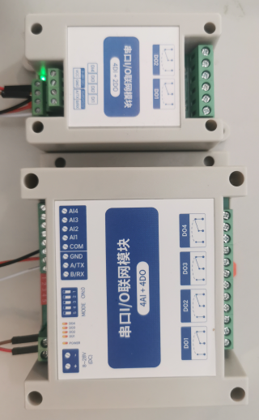

# modbus

**generic modbus plugin - deprecated, please use the mbus plugin**

to read and write values (analog/digital) via modbus, also supports hy_vfd spindles

* Keywords: modbus vfd spindle expansion analog digital
* NEEDS: fpga
* PROVIDES: modbus

## Pins:
*FPGA-pins*
### tx:

 * direction: output

### rx:

 * direction: input

### tx_enable:

 * direction: output
 * optional: True

## Options:
*user-options*
### name:
name of this plugin instance

 * type: str
 * default: 

### baud:
serial baud rate

 * type: int
 * min: 300
 * max: 10000000
 * default: 9600
 * unit: bit/s

### rx_buffersize:
max rx buffer size

 * type: int
 * min: 32
 * max: 255
 * default: 128
 * unit: bits

### tx_buffersize:
max tx buffer size

 * type: int
 * min: 32
 * max: 255
 * default: 128
 * unit: bits

## Signals:
*signals/pins in LinuxCNC*
### temperature:

 * type: float
 * direction: input
 * unit: °C

## Interfaces:
*transport layer*
### rxdata:

 * size: 128 bit
 * direction: input

### txdata:

 * size: 128 bit
 * direction: output

## Verilogs:
 * [modbus.v](modbus.v)
 * [uart_baud.v](uart_baud.v)
 * [uart_rx.v](uart_rx.v)
 * [uart_tx.v](uart_tx.v)
