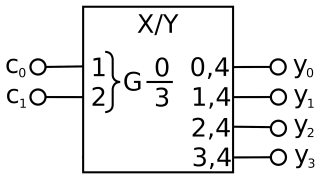

# mux

**binary multiplexer**

encodes binary values

* Keywords: binary multiplexer
* NEEDS: fpga

## Pins:
*FPGA-pins*
### pin0:

 * direction: output

### pin1:

 * direction: output

### pin2:

 * direction: output

### pin3:

 * direction: output

## Options:
*user-options*
### name:
name of this plugin instance

 * type: str
 * default: 

### bits:
number of inputs

 * type: int
 * min: 1
 * max: 32
 * default: 2
 * unit: bits

## Signals:
*signals/pins in LinuxCNC*
### bit0:

 * type: bit
 * direction: output

### bit1:

 * type: bit
 * direction: output

## Interfaces:
*transport layer*
### bit0:

 * size: 1 bit
 * direction: output

### bit1:

 * size: 1 bit
 * direction: output

