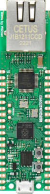

# ninja

**stepgen-ninja**

ninja

* Keywords: stepgen pwm ninja board pico w5500
* URL: https://github.com/atrex66/stepper-ninja
* PROVIDES: ninja, gpio, base, db25

## Node-Types
| Name | Image |
| --- | --- |
| board | - |
| stepper | - |
| pwm | - |
| encoder | - |

## Pins:
*FPGA-pins*
### IO:LED:

 * direction: all

### IO:GP15:

 * direction: all

### IO:GP14:

 * direction: all

### IO:GP13:

 * direction: all

### IO:GP12:

 * direction: all

### IO:GP11:

 * direction: all

### IO:GP10:

 * direction: all

### IO:GP9:

 * direction: all

### IO:GP8:

 * direction: all

### IO:GP7:

 * direction: all

### IO:GP6:

 * direction: all

### IO:GP5:

 * direction: all

### IO:GP4:

 * direction: all

### IO:GP3:

 * direction: all

### IO:GP2:

 * direction: all

### IO:GP1:

 * direction: all

### IO:GP0:

 * direction: all

### IO:GP16:

 * direction: all

### IO:GP17:

 * direction: all

### IO:GP18:

 * direction: all

### IO:GP19:

 * direction: all

### IO:GP20:

 * direction: all

### IO:GP21:

 * direction: all

### IO:GP22:

 * direction: all

### IO:GP26:

 * direction: all

### IO:GP27:

 * direction: all

### IO:GP28:

 * direction: all

## Options:
*user-options*
### name:
name of this plugin instance

 * type: str
 * default: 

### image:
hardware type

 * type: imgselect
 * default: generic

### node_type:
instance type

 * type: select
 * default: board
 * options: board, stepper, pwm, encoder

### board:
board type

 * type: select
 * default: w5500-evb-pico
 * options: w5500-evb-pico-parport, w5500-evb-pico

### mac:
MAC-Address

 * type: str
 * default: 00:08:DC:12:34:56

### ip:
IP-Address

 * type: str
 * default: 192.168.0.177

### mask:
Network-Mask

 * type: str
 * default: 255.255.255.0

### gw:
Gateway IP-Address

 * type: str
 * default: 192.168.10.1

### port:
UDP-Port

 * type: int
 * default: 8888

## Signals:
*signals/pins in LinuxCNC*

## Interfaces:
*transport layer*

