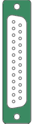

# parport



**gpio support over parallel port**

PC parallel port used as gpio

Keywords: parport gpio

## Pins:
*FPGA-pins*
### DB25:P1:

 * direction: all

### DB25:P2:

 * direction: all

### DB25:P3:

 * direction: all

### DB25:P4:

 * direction: all

### DB25:P5:

 * direction: all

### DB25:P6:

 * direction: all

### DB25:P7:

 * direction: all

### DB25:P8:

 * direction: all

### DB25:P9:

 * direction: all

### DB25:P10:

 * direction: input

### DB25:P11:

 * direction: input

### DB25:P12:

 * direction: input

### DB25:P13:

 * direction: input

### DB25:P14:

 * direction: all

### DB25:P15:

 * direction: input

### DB25:P16:

 * direction: all

### DB25:P17:

 * direction: all


## Options:
*user-options*
### name:
name of this plugin instance

 * type: str
 * default: 

### portaddr:
parport address

 * type: select
 * default: 0


## Signals:
*signals/pins in LinuxCNC*


## Interfaces:
*transport layer*


## Basic-Example:
```
{
    "type": "parport",
    "pins": {
        "DB25:P1": {
            "pin": "0"
        },
        "DB25:P2": {
            "pin": "1"
        },
        "DB25:P3": {
            "pin": "2"
        },
        "DB25:P4": {
            "pin": "3"
        },
        "DB25:P5": {
            "pin": "4"
        },
        "DB25:P6": {
            "pin": "5"
        },
        "DB25:P7": {
            "pin": "6"
        },
        "DB25:P8": {
            "pin": "7"
        },
        "DB25:P9": {
            "pin": "8"
        },
        "DB25:P10": {
            "pin": "9"
        },
        "DB25:P11": {
            "pin": "10"
        },
        "DB25:P12": {
            "pin": "11"
        },
        "DB25:P13": {
            "pin": "12"
        },
        "DB25:P14": {
            "pin": "13"
        },
        "DB25:P15": {
            "pin": "14"
        },
        "DB25:P16": {
            "pin": "15"
        },
        "DB25:P17": {
            "pin": "16"
        }
    }
}
```

## Full-Example:
```
{
    "type": "parport",
    "name": "",
    "portaddr": "0",
    "pins": {
        "DB25:P1": {
            "pin": "0",
            "modifiers": [
                {
                    "type": "invert"
                }
            ]
        },
        "DB25:P2": {
            "pin": "1",
            "modifiers": [
                {
                    "type": "invert"
                }
            ]
        },
        "DB25:P3": {
            "pin": "2",
            "modifiers": [
                {
                    "type": "invert"
                }
            ]
        },
        "DB25:P4": {
            "pin": "3",
            "modifiers": [
                {
                    "type": "invert"
                }
            ]
        },
        "DB25:P5": {
            "pin": "4",
            "modifiers": [
                {
                    "type": "invert"
                }
            ]
        },
        "DB25:P6": {
            "pin": "5",
            "modifiers": [
                {
                    "type": "invert"
                }
            ]
        },
        "DB25:P7": {
            "pin": "6",
            "modifiers": [
                {
                    "type": "invert"
                }
            ]
        },
        "DB25:P8": {
            "pin": "7",
            "modifiers": [
                {
                    "type": "invert"
                }
            ]
        },
        "DB25:P9": {
            "pin": "8",
            "modifiers": [
                {
                    "type": "invert"
                }
            ]
        },
        "DB25:P10": {
            "pin": "9",
            "modifiers": [
                {
                    "type": "debounce"
                },
                {
                    "type": "invert"
                }
            ]
        },
        "DB25:P11": {
            "pin": "10",
            "modifiers": [
                {
                    "type": "debounce"
                },
                {
                    "type": "invert"
                }
            ]
        },
        "DB25:P12": {
            "pin": "11",
            "modifiers": [
                {
                    "type": "debounce"
                },
                {
                    "type": "invert"
                }
            ]
        },
        "DB25:P13": {
            "pin": "12",
            "modifiers": [
                {
                    "type": "debounce"
                },
                {
                    "type": "invert"
                }
            ]
        },
        "DB25:P14": {
            "pin": "13",
            "modifiers": [
                {
                    "type": "invert"
                }
            ]
        },
        "DB25:P15": {
            "pin": "14",
            "modifiers": [
                {
                    "type": "debounce"
                },
                {
                    "type": "invert"
                }
            ]
        },
        "DB25:P16": {
            "pin": "15",
            "modifiers": [
                {
                    "type": "invert"
                }
            ]
        },
        "DB25:P17": {
            "pin": "16",
            "modifiers": [
                {
                    "type": "invert"
                }
            ]
        }
    },
    "signals": {}
}
```
