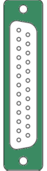

# parport

**gpio support over parallel port**

PC parallel port used as gpio

* Keywords: parport gpio
* PROVIDES: gpio, basethread, base, db25

## Pins:
*FPGA-pins*
### DB25:P1:

 * direction: all

### DB25:P2:

 * direction: all

### DB25:P3:

 * direction: all

### DB25:P4:

 * direction: all

### DB25:P5:

 * direction: all

### DB25:P6:

 * direction: all

### DB25:P7:

 * direction: all

### DB25:P8:

 * direction: all

### DB25:P9:

 * direction: all

### DB25:P10:

 * direction: input

### DB25:P11:

 * direction: input

### DB25:P12:

 * direction: input

### DB25:P13:

 * direction: input

### DB25:P14:

 * direction: all

### DB25:P15:

 * direction: input

### DB25:P16:

 * direction: all

### DB25:P17:

 * direction: all

## Options:
*user-options*
### name:
name of this plugin instance

 * type: str
 * default: 

### image:
hardware type

 * type: imgselect
 * default: generic

### portaddr:
parport address

 * type: select
 * default: 0
 * options: 0|1. port, 1|2. port, 2|3. port

## Signals:
*signals/pins in LinuxCNC*

## Interfaces:
*transport layer*

