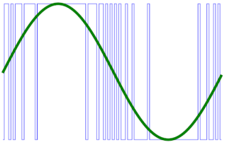

# pdmout

**pdm output**

to analog values via sigma-delta modulator

* Keywords: joint dcservo acservo 10v 5v dac analog sigma-delta pdm
* NEEDS: fpga

## Pins:
*FPGA-pins*
### pdm:

 * direction: output

### en:

 * direction: output
 * optional: True

## Options:
*user-options*
### name:
name of this plugin instance

 * type: str
 * default: 

### is_joint:
configure as joint

 * type: bool
 * default: True

### axis:
axis name (X,Y,Z,...)

 * type: select
 * default: None
 * options: X, Y, Z, A, B, C, U, V, W

### image:
hardware type

 * type: imgselect
 * default: generic

### resolution:
PDM Resolution

 * type: int
 * min: 8
 * max: 32
 * default: 8
 * unit: bit

## Signals:
*signals/pins in LinuxCNC*
### value:

 * type: float
 * direction: output
 * min: 0
 * max: 255
 * unit: %

### enable:

 * type: bit
 * direction: output

## Interfaces:
*transport layer*
### value:

 * size: 8 bit
 * direction: output

### enable:

 * size: 1 bit
 * direction: output

## Verilogs:
 * [pdmout.v](pdmout.v)
