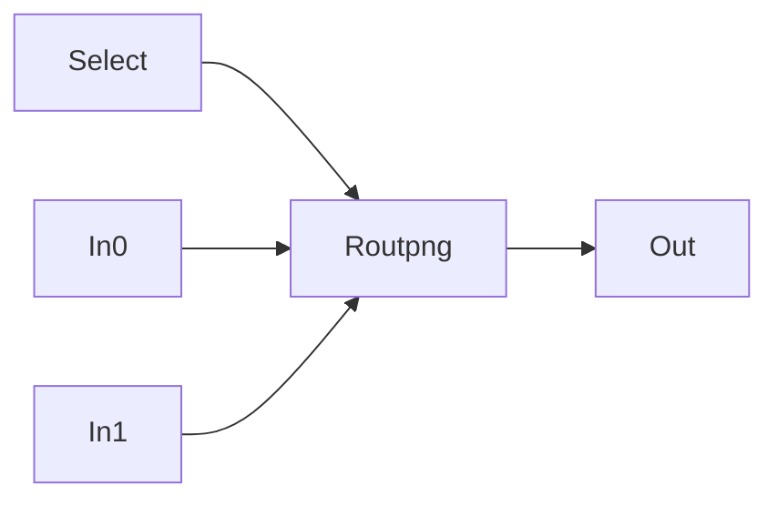

# pinroute


routing output pin to multiple inputs



## Pins:
*FPGA-pins*
### out:

 * direction: output

### in0:

 * direction: input

### in1:

 * direction: input


## Options:
*user-options*
### inputs:
number of inputs

 * type: int
 * default: 2

### name:
name of this plugin instance

 * type: str
 * default: 


## Signals:
*signals/pins in LinuxCNC*
### input:
input selector

 * type: float
 * direction: output
 * min: 0
 * max: 1


## Interfaces:
*transport layer*
### input:

 * size: 8 bit
 * direction: output
 * multiplexed: True


## Basic-Example:
```
{
    "type": "pinroute",
    "pins": {
        "out": {
            "pin": "0"
        },
        "in0": {
            "pin": "1"
        },
        "in1": {
            "pin": "2"
        }
    }
}
```

## Full-Example:
```
{
    "type": "pinroute",
    "inputs": 2,
    "name": "",
    "pins": {
        "out": {
            "pin": "0",
            "modifiers": [
                {
                    "type": "invert"
                }
            ]
        },
        "in0": {
            "pin": "1",
            "modifiers": [
                {
                    "type": "debounce"
                },
                {
                    "type": "invert"
                }
            ]
        },
        "in1": {
            "pin": "2",
            "modifiers": [
                {
                    "type": "debounce"
                },
                {
                    "type": "invert"
                }
            ]
        }
    },
    "signals": {
        "input": {
            "net": "xxx.yyy.zzz",
            "function": "rio.xxx",
            "scale": 100.0,
            "offset": 0.0,
            "display": {
                "title": "input",
                "section": "outputs",
                "type": "scale"
            }
        }
    }
}
```
