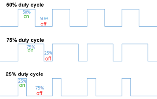

# pwmin
**pwm input**

measuring pulse len

Keywords: pulse digital




## Basic-Example:
```
{
    "type": "pwmin",
    "pins": {
        "pwm": {
            "pin": "0"
        }
    }
}
```

## Pins:
*FPGA-pins*
### pwm:

 * direction: input


## Options:
*user-options*
### freq_min:
minimum measured frequency (for faster updates)

 * type: int
 * min: 1
 * max: 10000
 * default: 10
 * unit: Hz

### name:
name of this plugin instance

 * type: str
 * default: 


## Signals:
*signals/pins in LinuxCNC*
### width:

 * type: float
 * direction: input
 * unit: ms

### valid:

 * type: bit
 * direction: input


## Interfaces:
*transport layer*
### width:

 * size: 32 bit
 * direction: input

### valid:

 * size: 1 bit
 * direction: input


## Full-Example:
```
{
    "type": "pwmin",
    "freq_min": 10,
    "name": "",
    "pins": {
        "pwm": {
            "pin": "0",
            "modifiers": [
                {
                    "type": "debounce"
                }
            ]
        }
    },
    "signals": {
        "width": {
            "net": "xxx.yyy.zzz",
            "function": "rio.xxx",
            "scale": 100.0,
            "offset": 0.0,
            "display": {
                "title": "width",
                "section": "inputs",
                "type": "meter"
            }
        },
        "valid": {
            "net": "xxx.yyy.zzz",
            "function": "rio.xxx",
            "display": {
                "title": "valid",
                "section": "inputs",
                "type": "led"
            }
        }
    }
}
```

## Verilogs:
 * [pwmin.v](pwmin.v)
