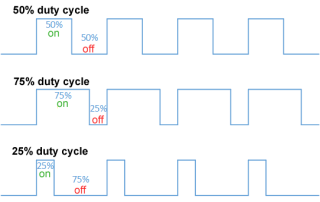

# pwmin

**pwm input**

measuring pulse len

* Keywords: pulse digital
* NEEDS: fpga

## Pins:
*FPGA-pins*
### pwm:

 * direction: input

## Options:
*user-options*
### name:
name of this plugin instance

 * type: str
 * default: 

### freq_min:
minimum measured frequency (for faster updates)

 * type: int
 * min: 1
 * max: 10000
 * default: 10
 * unit: Hz

## Signals:
*signals/pins in LinuxCNC*
### width:

 * type: float
 * direction: input
 * unit: ms

### valid:

 * type: bit
 * direction: input

## Interfaces:
*transport layer*
### width:

 * size: 32 bit
 * direction: input

### valid:

 * size: 1 bit
 * direction: input

## Verilogs:
 * [pwmin.v](pwmin.v)
