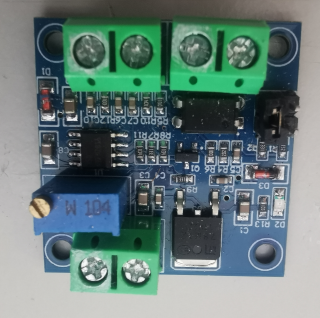

# pwmout

**pwm output**

to control AC/DC-Motors or for analog outputs

 PWM-Resolution: >= 11bit at 10000Hz and 24Mhz FPGA-Clock

* Keywords: joint dcservo acservo 10v 5v dac analog
* NEEDS: fpga

## Pins:
*FPGA-pins*
### pwm:

 * direction: output

### dir:

 * direction: output
 * optional: True

### en:

 * direction: output
 * optional: True

## Options:
*user-options*
### name:
name of this plugin instance

 * type: str
 * default: 

### is_joint:
configure as joint

 * type: bool
 * default: False

### axis:
axis name (X,Y,Z,...)

 * type: select
 * default: None
 * options: X, Y, Z, A, B, C, U, V, W

### image:
hardware type

 * type: imgselect
 * default: generic

### frequency:
PWM frequency

 * type: int
 * min: 10
 * max: 1000000
 * default: 10000
 * unit: Hz

### bitwidth:
bit-width on the interface frequency

 * type: select
 * default: 32
 * unit: bits
 * options: 32, 24, 16

## Signals:
*signals/pins in LinuxCNC*
### dty:

 * type: float
 * direction: output
 * min: 0
 * max: 100
 * unit: %

### enable:

 * type: bit
 * direction: output

## Interfaces:
*transport layer*
### dty:

 * size: 32 bit
 * direction: output

### enable:

 * size: 1 bit
 * direction: output

## Verilogs:
 * [pwmout.v](pwmout.v)
