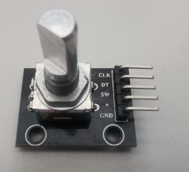

# quadencoder

**quadencoder**

usable as position feedback for closed-loop configuration or as variable input to control LinuxCNC overwrites

* Keywords: feedback encoder rotary linear glassscale
* NEEDS: fpga

## Pins:
*FPGA-pins*
### a:

 * direction: input
 * pull: up

### b:

 * direction: input
 * pull: up

## Options:
*user-options*
### name:
name of this plugin instance

 * type: str
 * default: 

### image:
hardware type

 * type: imgselect
 * default: generic

### quad_type:
The count from the encoder will be bitshifted by the value of QUAD_TYPE.
Use 0 for 4x mode.  The position-scale should match.
For examle if you have a 600 CPR encoder 4x mode will give you 2400 PPR and your scale should be set to 2400.

 * type: int
 * min: 0
 * max: 4
 * default: 2

### rps_sum:
number of collected values before calculate the rps value

 * type: int
 * min: 0
 * max: 100
 * default: 10

## Signals:
*signals/pins in LinuxCNC*
### position:
position feedback in steps

 * type: float
 * direction: input

### rps:
calculates revolutions per second

 * type: float
 * direction: input

### rpm:
calculates revolutions per minute

 * type: float
 * direction: input

## Interfaces:
*transport layer*
### position:

 * size: 32 bit
 * direction: input

## Verilogs:
 * [quadencoder.v](quadencoder.v)
