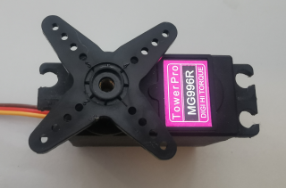

# rcservo

**rc-servo output**

to control rc-servos, usable as joint or as variable/analog output in LinuxCNC

* Keywords: joint rcservo
* NEEDS: fpga

## Pins:
*FPGA-pins*
### pwm:

 * direction: output

## Options:
*user-options*
### name:
name of this plugin instance

 * type: str
 * default: 

### is_joint:
configure as joint

 * type: bool
 * default: True

### axis:
axis name (X,Y,Z,...)

 * type: select
 * default: None
 * options: X, Y, Z, A, B, C, U, V, W

### image:
hardware type

 * type: imgselect
 * default: generic

### frequency:
update frequency

 * type: int
 * min: 20
 * max: 150
 * default: 100

## Signals:
*signals/pins in LinuxCNC*
### position:
absolute position (-100 = 1ms / 100 = 2ms)

 * type: float
 * direction: output
 * min: -100.0
 * max: 100.0

### enable:

 * type: bit
 * direction: output

## Interfaces:
*transport layer*
### position:

 * size: 32 bit
 * direction: output

### enable:

 * size: 1 bit
 * direction: output

## Verilogs:
 * [rcservo.v](rcservo.v)
