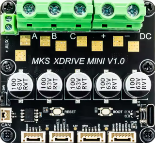

# riodrive

| :warning: EXPERIMENTAL |
|:-----------------------|

**to control a riodrive via can-bus**

riodrive is a fork of odrive (v3.6)

* Keywords: canbus odrive bldc brushless servo
* URL: https://github.com/multigcs/riodrive
* NEEDS: fpga

## Pins:
*FPGA-pins*
### tx:

 * direction: output

### rx:

 * direction: input

## Options:
*user-options*
### name:
name of this plugin instance

 * type: str
 * default: 

### is_joint:
configure as joint

 * type: bool
 * default: True

### axis:
axis name (X,Y,Z,...)

 * type: select
 * default: None
 * options: X, Y, Z, A, B, C, U, V, W

### baud:
can-bus baud rate

 * type: int
 * min: 300
 * max: 10000000
 * default: 500000
 * unit: bit/s

### interval:
update interval

 * type: int
 * min: 100
 * max: 10000
 * default: 400
 * unit: Hz

### error:
trigger error on connection/drive problems

 * type: bool
 * default: True

## Signals:
*signals/pins in LinuxCNC*
### power:

 * type: float
 * direction: input
 * unit: W

### temp:

 * type: float
 * direction: input
 * unit: °C

### state:

 * type: float
 * direction: input
 * unit: 

### traj:

 * type: bit
 * direction: input
 * unit: 

### mot:

 * type: bit
 * direction: input
 * unit: 

### enc:

 * type: bit
 * direction: input
 * unit: 

### ctrl:

 * type: bit
 * direction: input
 * unit: 

### position:

 * type: float
 * direction: input
 * unit: 

### velocity:

 * type: float
 * direction: output
 * min: -100
 * max: 100
 * unit: 

### enable:

 * type: bit
 * direction: output

### error:

 * type: bit
 * direction: input

## Interfaces:
*transport layer*
### power:

 * size: 16 bit
 * direction: input

### temp:

 * size: 8 bit
 * direction: input

### state:

 * size: 4 bit
 * direction: input

### traj:

 * size: 1 bit
 * direction: input

### mot:

 * size: 1 bit
 * direction: input

### enc:

 * size: 1 bit
 * direction: input

### ctrl:

 * size: 1 bit
 * direction: input

### position:

 * size: 32 bit
 * direction: input

### velocity:

 * size: 32 bit
 * direction: output

### enable:

 * size: 1 bit
 * direction: output

### error:

 * size: 1 bit
 * direction: input

## Verilogs:
 * [riodrive.v](riodrive.v)
 * [canbus_tx.v](canbus_tx.v)
 * [canbus_rx.v](canbus_rx.v)
