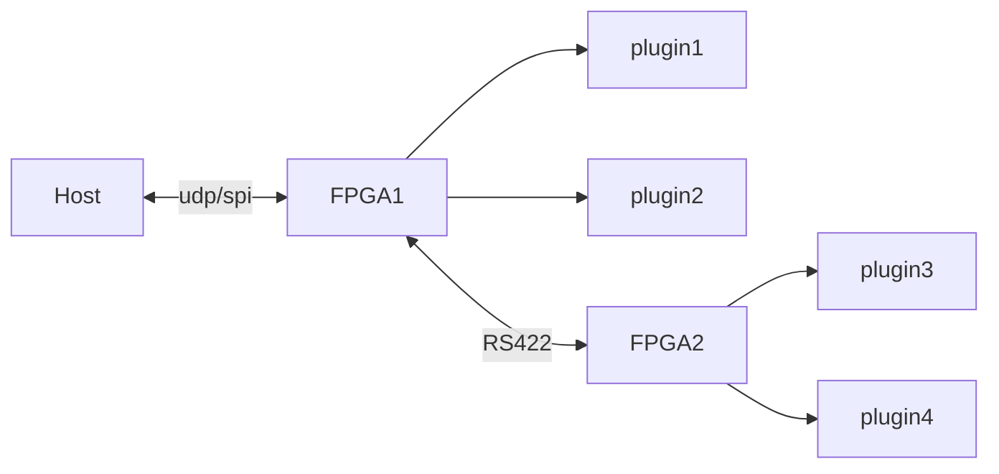

# riosub


| :warning: EXPERIMENTAL |
|:-----------------------|

**rio sub board**

to combine multible RIO boards via RS422 and/or RS485

* the sub config must setup 'uart' as interface with checksum activated



## Pins:
*FPGA-pins*
### tx:

 * direction: output

### rx:

 * direction: input

### tx_enable:

 * direction: output
 * optional: True


## Options:
*user-options*
### subconfig:
sub json-config file

 * type: file
 * default: 
 * unit: 

### baud:
serial baud rate

 * type: int
 * min: 9600
 * max: 10000000
 * default: 1000000
 * unit: bit/s

### name:
name of this plugin instance

 * type: str
 * default: 


## Signals:
*signals/pins in LinuxCNC*
### valid:

 * type: bit
 * direction: input


## Interfaces:
*transport layer*
### valid:

 * size: 1 bit
 * direction: input


## Basic-Example:
```
{
    "type": "riosub",
    "pins": {
        "tx": {
            "pin": "0"
        },
        "rx": {
            "pin": "1"
        },
        "tx_enable": {
            "pin": "2"
        }
    }
}
```

## Full-Example:
```
{
    "type": "riosub",
    "subconfig": "",
    "baud": 1000000,
    "name": "",
    "pins": {
        "tx": {
            "pin": "0",
            "modifiers": [
                {
                    "type": "invert"
                }
            ]
        },
        "rx": {
            "pin": "1",
            "modifiers": [
                {
                    "type": "debounce"
                },
                {
                    "type": "invert"
                }
            ]
        },
        "tx_enable": {
            "pin": "2",
            "modifiers": [
                {
                    "type": "invert"
                }
            ]
        }
    },
    "signals": {
        "valid": {
            "net": "xxx.yyy.zzz",
            "function": "rio.xxx",
            "display": {
                "title": "valid",
                "section": "inputs",
                "type": "led"
            }
        }
    }
}
```

## Verilogs:
 * [uart_baud.v](uart_baud.v)
 * [uart_rx.v](uart_rx.v)
 * [uart_tx.v](uart_tx.v)
