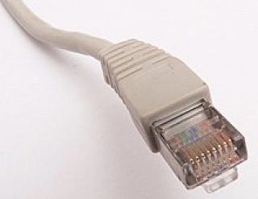

# rmii

| :warning: EXPERIMENTAL |
|:-----------------------|

**rmii udp interface**

rmii ethernet - udp interface - only for tangprimer20k with gowin toolchain - problems with yosys (bram)

* Keywords: interface network ethernet udp
* NEEDS: fpga

## Pins:
*FPGA-pins*
### netrmii_clk50m:

 * direction: input

### netrmii_rx_crs:

 * direction: input

### netrmii_mdc:

 * direction: output

### netrmii_txen:

 * direction: output

### netrmii_mdio:

 * direction: inout

### netrmii_txd_0:

 * direction: output

### netrmii_txd_1:

 * direction: output

### netrmii_rxd_0:

 * direction: input

### netrmii_rxd_1:

 * direction: input

### phyrst:

 * direction: output
 * optional: True

## Options:
*user-options*
### name:
name of this plugin instance

 * type: str
 * default: 

### image:
hardware type

 * type: imgselect
 * default: generic

### mac:
MAC-Address

 * type: str
 * default: AA:AF:FA:CC:E3:1C

### ip:
IP-Address

 * type: str
 * default: 192.168.10.194

### mask:
Network-Mask

 * type: str
 * default: 255.255.255.0

### gw:
Gateway IP-Address

 * type: str
 * default: 192.168.10.1

### port:
UDP-Port

 * type: int
 * default: 2390

## Signals:
*signals/pins in LinuxCNC*

## Interfaces:
*transport layer*

## Verilogs:
 * [udp.v](udp.v)
 * [rmii.v](rmii.v)
