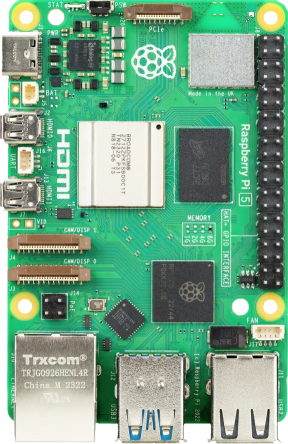

# rpigpio



**gpio support**

gpio support for Raspberry PI4/5 and maybe other boards

Keywords: rpi gpio raspberry rpi4 rpi5

## Pins:
*FPGA-pins*


## Options:
*user-options*
### name:
name of this plugin instance

 * type: str
 * default: 


## Signals:
*signals/pins in LinuxCNC*


## Interfaces:
*transport layer*


## Basic-Example:
```
{
    "type": "rpigpio",
    "pins": {}
}
```

## Full-Example:
```
{
    "type": "rpigpio",
    "name": "",
    "pins": {},
    "signals": {}
}
```
