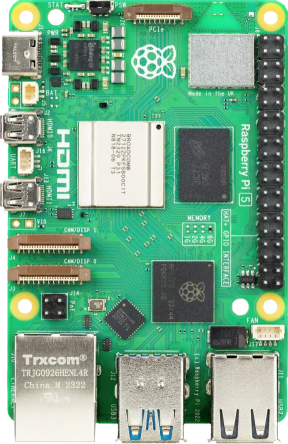

# rpigpio

**gpio support**

gpio support for Raspberry PI4/5 and maybe other boards

gpio modes:
* rpi5: hal_gpio: gpioinfo shows GPIO7 for GPIO7
* rpi4: hal_gpio: gpioinfo shows SPI_CE1_N for GPIO7
* pi_gpio: hal_pi_gpio: no invert support, not for rpi5

* Keywords: rpi gpio raspberry rpi4 rpi5
* PROVIDES: gpio, basethread, base, rpigpio

## Pins:
*FPGA-pins*
### GPIO:P3:

 * direction: all

### GPIO:P5:

 * direction: all

### GPIO:P7:

 * direction: all

### GPIO:P8:

 * direction: all

### GPIO:P10:

 * direction: all

### GPIO:P11:

 * direction: all

### GPIO:P12:

 * direction: all

### GPIO:P13:

 * direction: all

### GPIO:P15:

 * direction: all

### GPIO:P16:

 * direction: all

### GPIO:P18:

 * direction: all

### GPIO:P19:

 * direction: all

### GPIO:P21:

 * direction: all

### GPIO:P22:

 * direction: all

### GPIO:P23:

 * direction: all

### GPIO:P24:

 * direction: all

### GPIO:P26:

 * direction: all

### GPIO:P29:

 * direction: all

### GPIO:P31:

 * direction: all

### GPIO:P32:

 * direction: all

### GPIO:P33:

 * direction: all

### GPIO:P35:

 * direction: all

### GPIO:P36:

 * direction: all

### GPIO:P37:

 * direction: all

### GPIO:P38:

 * direction: all

### GPIO:P40:

 * direction: all

## Options:
*user-options*
### name:
name of this plugin instance

 * type: str
 * default: 

### image:
hardware type

 * type: imgselect
 * default: generic

### mode:
gpio mode (rpi5: gpioinfo shows GPIO7 / rpi4: gpioinfo shows SPI_CE1_N for GPIO7)

 * type: select
 * default: rpi5
 * options: rpi5, rpi4, pi_gpio

## Signals:
*signals/pins in LinuxCNC*

## Interfaces:
*transport layer*

