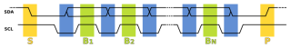

# rpii2c

**gpio support over i2c port**

gpio support over i2c port

* Keywords: ii2c gpio

## Pins:
*FPGA-pins*
### IO:P7:

 * direction: all

### IO:P6:

 * direction: all

### IO:P5:

 * direction: all

### IO:P4:

 * direction: all

### IO:P3:

 * direction: all

### IO:P2:

 * direction: all

### IO:P1:

 * direction: all

### IO:P0:

 * direction: all

## Options:
*user-options*
### name:
name of this plugin instance

 * type: str
 * default: 

### device:
i2c device

 * type: select
 * default: pcf8574
 * options: pcf8574, ads1115, lm75, hd44780

### address:
slave address

 * type: select
 * default: 0x20
 * options: 0x20, 0x21, 0x22, 0x23, 0x24, 0x25, 0x26, 0x27, 0x48, 0x49

## Signals:
*signals/pins in LinuxCNC*

## Interfaces:
*transport layer*

