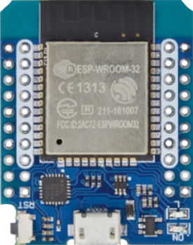
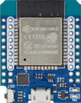
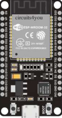
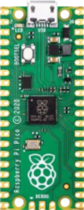
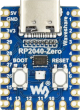

# satmcu

**mcu based satellite**

mcu based satellite connected via RS422

* NEEDS: fpga
* PROVIDES: mcu

## Node-Types
| Name | Image |
| --- | --- |
| wemos_d1_mini32 |  |
| mpgsat |  |
| esp32dev |  |
| pico |  |
| vfdsat |  |
| rp2040-zero |  |

## Pins:
*FPGA-pins*
### SAT:

 * direction: output
 * optional: True

### IO:2:

 * direction: all

### IO:3:

 * direction: all

### IO:4:

 * direction: all

### IO:5:

 * direction: all

### IO:6:

 * direction: all

### IO:7:

 * direction: all

### IO:8:

 * direction: all

### IO:9:

 * direction: all

### IO:10:

 * direction: all

### IO:11:

 * direction: all

### IO:12:

 * direction: all

### IO:13:

 * direction: all

### IO:14:

 * direction: all

### IO:15:

 * direction: all

### IO:28:

 * direction: all

### IO:27:

 * direction: all

### IO:26:

 * direction: all

### IO:22:

 * direction: all

### IO:21:

 * direction: all

### IO:20:

 * direction: all

### IO:19:

 * direction: all

### IO:18:

 * direction: all

### IO:17:

 * direction: all

### IO:16:

 * direction: all

## Options:
*user-options*
### name:
name of this plugin instance

 * type: str
 * default: 

### node_type:
board type

 * type: select
 * default: pico
 * options: wemos_d1_mini32, mpgsat, esp32dev, pico, vfdsat, rp2040-zero

### baud:
serial baud rate

 * type: int
 * min: 9600
 * max: 10000000
 * default: 1000000
 * unit: bit/s

### upload_port:
debug-port

 * type: str
 * default: /dev/ttyACM0

### serial:
mcu serial port (Serial == USB)

 * type: select
 * default: Serial1
 * options: Serial, Serial1

## Signals:
*signals/pins in LinuxCNC*

## Interfaces:
*transport layer*

## Verilogs:
 * [satmcu.v](satmcu.v)
 * [uart_baud.v](uart_baud.v)
 * [uart_rx.v](uart_rx.v)
 * [uart_tx.v](uart_tx.v)
