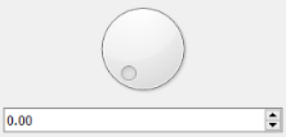

# signal
**virtual signal**

virtual signal

Keywords: virtual




## Basic-Example:
```
{
    "type": "signal",
    "pins": {}
}
```

## Pins:
*FPGA-pins*


## Options:
*user-options*
### dir:
signal direction

 * type: select
 * default: input

### vtype:
signal type

 * type: select
 * default: float

### name:
name of this plugin instance

 * type: str
 * default: 


## Signals:
*signals/pins in LinuxCNC*
### value:

 * type: float
 * direction: input


## Interfaces:
*transport layer*


## Full-Example:
```
{
    "type": "signal",
    "dir": "input",
    "vtype": "float",
    "name": "",
    "pins": {},
    "signals": {
        "value": {
            "net": "xxx.yyy.zzz",
            "function": "rio.xxx",
            "scale": 100.0,
            "offset": 0.0,
            "display": {
                "title": "value",
                "section": "inputs",
                "type": "meter"
            }
        }
    }
}
```
