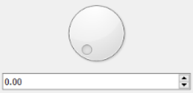

# signal

**virtual signal**

virtual signal

* Keywords: virtual

## Pins:
*FPGA-pins*

## Options:
*user-options*
### name:
name of this plugin instance

 * type: str
 * default: 

### image:
hardware type

 * type: imgselect
 * default: generic

### dir:
signal direction

 * type: select
 * default: input
 * options: input, output

### vtype:
signal type

 * type: select
 * default: float
 * options: float, bool

## Signals:
*signals/pins in LinuxCNC*
### value:

 * type: float
 * direction: input

## Interfaces:
*transport layer*

