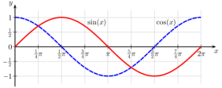

# sinepwm
**sine pwm output**

generates sine waves (multi phase support)

Keywords: sine wave pwm bldc stepper




## Basic-Example:
```
{
    "type": "sinepwm",
    "pins": {
        "en": {
            "pin": "0"
        },
        "out0": {
            "pin": "1"
        }
    }
}
```

## Pins:
*FPGA-pins*
### en:

 * direction: output
 * optional: True

### out0:

 * direction: output


## Options:
*user-options*
### pwmfreq:
pwm frequency

 * type: int
 * min: 10
 * max: 100000
 * default: 25000
 * unit: Hz

### start:
wace start point

 * type: int
 * min: 0
 * max: 28
 * default: 0
 * unit: 

### phases:
number of output phases

 * type: int
 * min: 0
 * max: 10
 * default: 1
 * unit: 

### name:
name of this plugin instance

 * type: str
 * default: 


## Signals:
*signals/pins in LinuxCNC*
### freq:

 * type: float
 * direction: output
 * min: -255
 * max: 255
 * unit: Hz

### enable:

 * type: bit
 * direction: output


## Interfaces:
*transport layer*
### freq:

 * size: 32 bit
 * direction: output

### enable:

 * size: 1 bit
 * direction: output


## Full-Example:
```
{
    "type": "sinepwm",
    "pwmfreq": 25000,
    "start": 0,
    "phases": 1,
    "name": "",
    "pins": {
        "en": {
            "pin": "0",
            "modifiers": [
                {
                    "type": "invert"
                }
            ]
        },
        "out0": {
            "pin": "1",
            "modifiers": [
                {
                    "type": "invert"
                }
            ]
        }
    },
    "signals": {
        "freq": {
            "net": "xxx.yyy.zzz",
            "function": "rio.xxx",
            "scale": 100.0,
            "offset": 0.0,
            "display": {
                "title": "freq",
                "section": "outputs",
                "type": "scale"
            }
        },
        "enable": {
            "net": "xxx.yyy.zzz",
            "function": "rio.xxx",
            "display": {
                "title": "enable",
                "section": "outputs",
                "type": "checkbox"
            }
        }
    }
}
```

## Verilogs:
 * [sinepwm.v](sinepwm.v)
