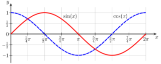

# sinepwm

**sine pwm output**

generates sine waves (multi phase support)

* Keywords: sine wave pwm bldc stepper
* NEEDS: fpga

## Pins:
*FPGA-pins*
### en:

 * direction: output
 * optional: True

### out0:

 * direction: output

## Options:
*user-options*
### name:
name of this plugin instance

 * type: str
 * default: 

### image:
hardware type

 * type: imgselect
 * default: generic

### pwmfreq:
pwm frequency

 * type: int
 * min: 10
 * max: 100000
 * default: 25000
 * unit: Hz

### start:
wace start point

 * type: int
 * min: 0
 * max: 28
 * default: 0
 * unit: 

### phases:
number of output phases

 * type: int
 * min: 0
 * max: 10
 * default: 1
 * unit: 

## Signals:
*signals/pins in LinuxCNC*
### freq:

 * type: float
 * direction: output
 * min: -255
 * max: 255
 * unit: Hz

### enable:

 * type: bit
 * direction: output

## Interfaces:
*transport layer*
### freq:

 * size: 32 bit
 * direction: output

### enable:

 * size: 1 bit
 * direction: output

## Verilogs:
 * [sinepwm.v](sinepwm.v)
