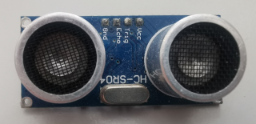

# sonar

**sonar sensor for distance measurement**

to messure distance via cheap ultra-sonic sensors (like filling level of bigger water tanks)

* Keywords: distance ultrasonic level oil water
* NEEDS: fpga

## Pins:
*FPGA-pins*
### trigger:

 * direction: output

### echo:

 * direction: input

## Options:
*user-options*
### name:
name of this plugin instance

 * type: str
 * default: 

## Signals:
*signals/pins in LinuxCNC*
### distance:
distance between sensor and object

 * type: float
 * direction: input
 * unit: cm

## Interfaces:
*transport layer*
### distance:

 * size: 32 bit
 * direction: input

## Verilogs:
 * [sonar.v](sonar.v)
